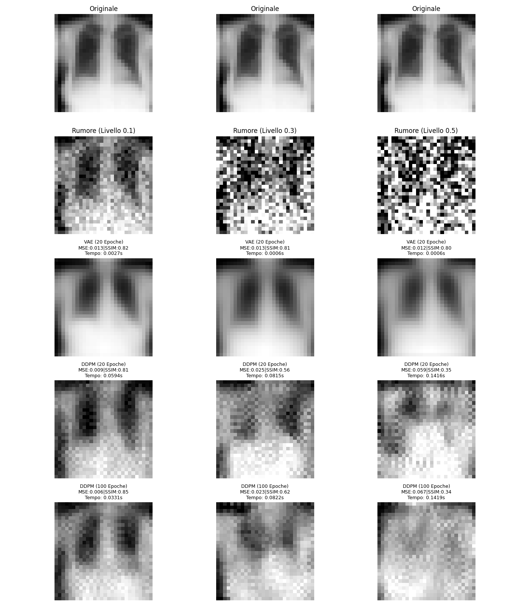

# Modelli Diffusivi:  
# Formalizzazione Teorica Implementazione e Applicazioni in Ambito Sanitario



Questo repository contiene l'implementazione del codice della mia tesi triennale, in ambito modelli generativi, in particolare il confronto di ricostruzione tra le architetture VAE e DDPM.

## Setup e Run

L'utilizzo di Docker permette la massima portabilità e riproducibilità, rendendo possibile verificare i risultati su diversi sistemi senza problemi di dipendenze.

### Prerequisiti
- Docker installato
- Docker Compose installato

### Build dell'ambiente

Per costruire l'immagine Docker:

```bash
docker compose build
```

Dopo aver effettuato il build dell'imamgine avviamo il codice
```bash
docker compose up
```